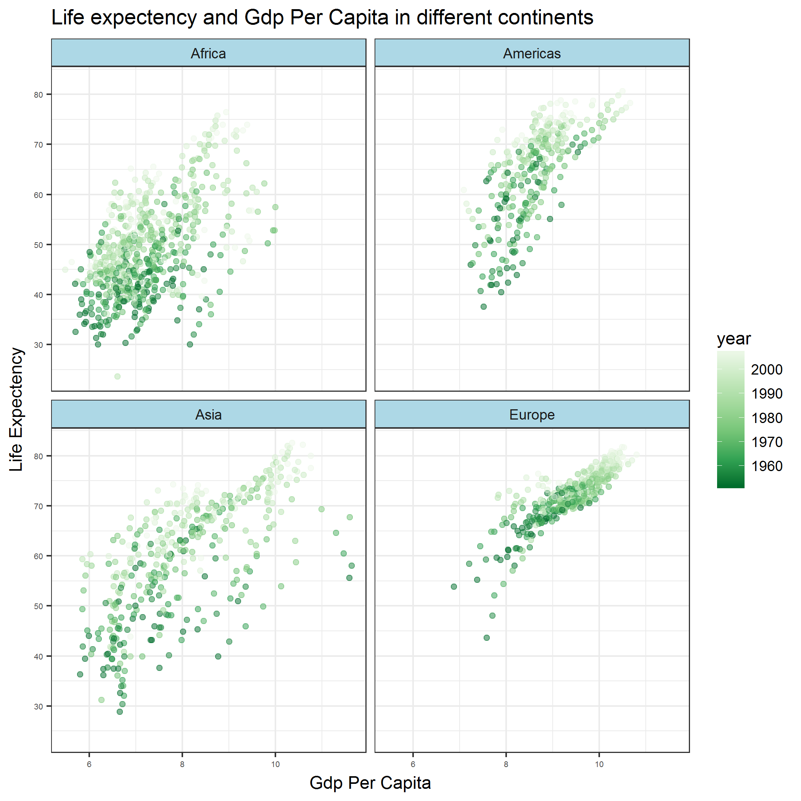
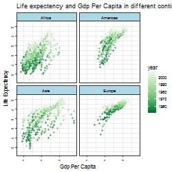
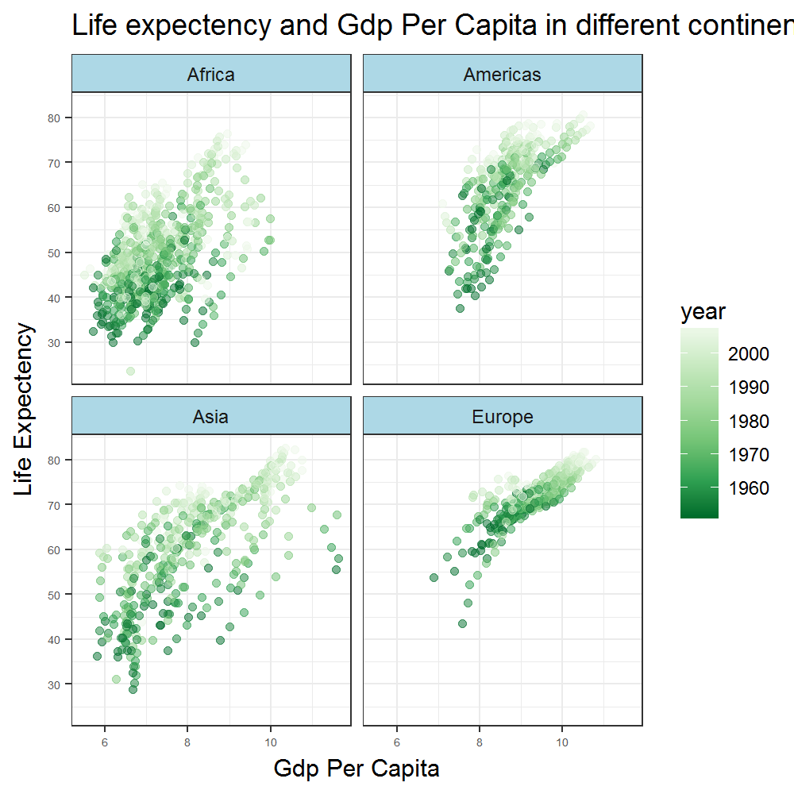

```{r setup, include=FALSE}
knitr::opts_chunk$set(echo = TRUE, message = FALSE, warning = FALSE, fig.align = 'center')
```

## Part 1: Factor management

- Load `Gapminder` and `tidyverse`:
```{r}
library(gapminder)
library(tidyverse)
library(knitr)
library(plotly)
install.packages("kableExtra")
library(kableExtra)
```

To ensure that the variable(s) I'm about to explore are indeed factors, I check the structure of the `Gapminder` dataset

```{r}
gapminder %>% 
  str()
```

The output shows that the variables `country` and `continent` are indeed factors.


### Exploring the effects of `arrange`

We first explore the effects of the `arrange()` functions. In the following code, we attempt to sort the data by the mean life expectancy in 2007 for each continent:

```{r}
gap_meanLifeExp_1 <- gapminder %>%
  filter(year == 2007) %>%
  group_by(continent) %>%
  summarize(meanLifeExp = mean(lifeExp)) %>%
  arrange(meanLifeExp)  # Arrange the row according to meanLifeExp

knitr::kable(gap_meanLifeExp_1)
```


### Reorder the levels of `country` or `continent`

Before observations associated with the continent of Oceania are filtered, the number of levels of continent are 5 (what can be seen above with the structre function).

```{r}
nrow(gapminder)
```
The row number before Oceania is filtered is 1704.


```{r}
Oceania_filtered <- gapminder %>% 
  filter(continent != "Oceania")
str(Oceania_filtered)
```


```{r}
nrow(Oceania_filtered)
```
  The number of rows reduced to 1680 after removing the observations associated with   Oceania.


As a next step, unused factor levels will be removed.
```{r}
removed <- Oceania_filtered %>% 
  mutate(continent=fct_drop(continent))
  str(removed)
```


Continent factors after removing unused factor levels decreased from 5 to 4. 
   
```{r}
nrow(removed)
```
The row number is still 1680.


```{r}
removed_l <- Oceania_filtered %>% 
  droplevels() 
  str(removed_l)
  nrow(removed_l)
```

### Reordering of the levels of contry or continent 


I'll look at Europe in 2007.

```{r}
europe_2007 <- gapminder %>%
  filter(year == 2007, continent == "Europe")
```

```{r}
europe_2007 %>%
  kable()
```


The Countries are ordered alphabetically. Depending on our interest it can make more sense to order them differently.
A bar chart of the gdpPercap in each country:

```{r}
europe_2007 %>%
  ggplot(aes(country, gdpPercap, fill = country)) +
  geom_bar(stat = "identity", show.legend = FALSE) +
  coord_flip() +
  theme_bw()
```

Here, ordering the countries not alphabetically but with increasing gdpPercap would be a good option.
For this, I use the `arrange`and `fct_reorder` command.


```{r}
europe_2007 %>%
  arrange(gdpPercap) %>%
  mutate(country = fct_reorder(country, gdpPercap)) %>%
  kable()
```

Now te table is ordered by gdpPerCap.
I'll do the same with the bar chart.

```{r}
europe_2007 %>%
  arrange(gdpPercap) %>%
  mutate(country = fct_reorder(country, gdpPercap)) %>%
  ggplot(aes(country, gdpPercap, fill = country)) +
  geom_bar(stat = "identity", show.legend = FALSE) +
  coord_flip() +
  theme_bw()
```


## Part 2: File I/O

I will have a closer look on Asia and reorder the countries regarding their life Expectancy.


First, I filter the gapminder dataset for asian countries
```{r}
gap_asia <- gapminder %>%
  filter(continent == "Asia") 
```

Second, I reorder the countries regarding their life Expectancy
```{r}
gap_asia_lifeExpOrder<- gap_asia %>%
  mutate(country = fct_reorder
         (country, pop, max, .desc = TRUE))
```

Levels after the reordering:
```{r}
(levels(gap_asia_lifeExpOrder$country))
```
-> The countries are successfully reordered
 
As a next step, I experiment with the `write_csv()` and other functions.

I write the created dataset from above in different formats. Here it is important to notice, that some of the levels change, depending on which function one uses.
```{r}
write_csv(gap_asia_lifeExpOrder, "gap_asia_lifeExpOrder.csv")
write_tsv(gap_asia_lifeExpOrder, "gap_asia_lifeExpOrder.tsv")
saveRDS(gap_asia_lifeExpOrder, "gap_asia_lifeExpOrder.rds")
dput(gap_asia_lifeExpOrder, "gap_asia_lifeExpOrder.txt")
```

Trying to rewrite them:
```{r}
gap_asia_lifeExpOrder_csv <- read_csv("gap_asia_lifeExpOrder.csv")
gap_asia_lifeExpOrder_tsv <- read_tsv("gap_asia_lifeExpOrder.tsv")
gap_asia_lifeExpOrder_rds <- readRDS("gap_asia_lifeExpOrder.rds")
gap_asia_lifeExpOrder_txt <- dget("gap_asia_lifeExpOrder.txt")
```


## Part 3: Visualization design

The graph below shows where we start. It is not too bad, but with a little more working we can make it different.

```{r}
gapminder %>% 
  ggplot(aes(log(gdpPercap), 
             lifeExp, 
             color = year)) + 
  geom_point()
```

Now here is what it looks like after some hard working. It is more readable, with more infos, and has a title now so people know what it is for.

```{r}
(plot <- 
  gapminder %>% 
  filter(continent != "Oceania") %>%
  ggplot(aes(log(gdpPercap), lifeExp)) + 
  geom_point(aes(color = year), alpha = 0.5) + 
  scale_colour_distiller(palette = "Greens") +
  facet_wrap(~continent) + 
  scale_y_continuous(breaks = 10*1:10) +
  theme_bw() +
  labs(x = "Gdp Per Capita",
       y = "Life Expectency",
       title = "Life expectency and Gdp Per Capita in different continents"
       ) +
  theme(axis.text = element_text(size = 5),
        strip.background = element_rect(fill = "lightblue")
        )
)
  
```

With the code underneath, the plot gets transferred into a plotly graph. Unfortunately, my R can't find the plotly package (I tried installing it multiple times). The plotly function enables to interact with the plot much better.

```{r}
ggplotly(plot)
```


## Part 4: Writing figures to file

By using `ggsave` we can save the plot to a local file (without specifying it's quality)

```{r}
ggsave("plot.png", plot)
```

Then we can load it back from files in a html way.



The format / quality of the saved plot can be specified:

```{r}
ggsave("plot_s.bmp", plot, device = "bmp", height = 5, width = 5, dpi = 50)
ggsave("plot_b.bmp", plot, device = "bmp", height = 5, width = 5, dpi = 200)
```

After that we can reload the data to see the result:






